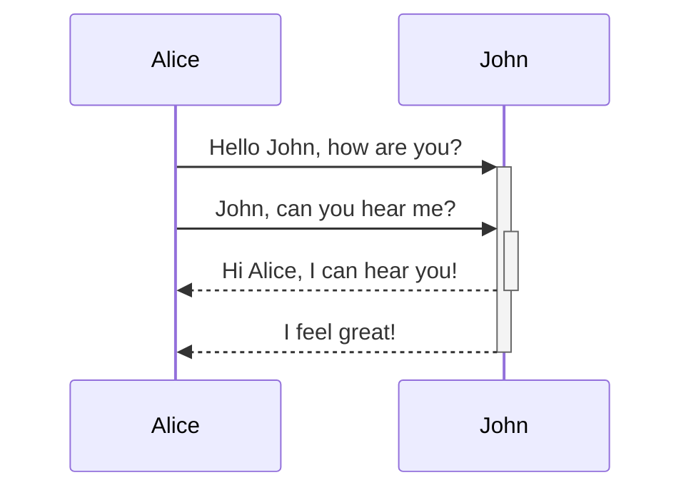
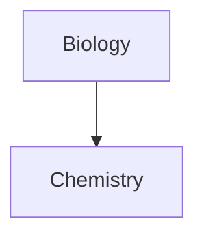

格式化你的笔记

Obsidian 是一款基于 Markdown 的笔记和知识库应用程序。

我们目前支持以下格式：

---

### 内部链接

```md
Link to a page: [[Internal link]].
```

链接到页面：[内部链接](https://help.obsidian.md/How+to/Internal+link)。

---

### 嵌入

嵌入另一个文件（阅读有关[嵌入文件的](https://help.obsidian.md/How+to/Embed+files)更多信息）。这是一个嵌入式部分：

```md
![[Obsidian#What is Obsidian]]
```

## 什么是黑曜石

Obsidian 既是 Markdown 编辑器又是知识库应用程序。

以最基本的方式使用，你可以编辑和预览 Markdown 文件。但它的真正力量在于管理密集网络化的知识库。

你问我们如何开始创建网络？让我们首先开始制作一些[内部链接](https://help.obsidian.md/How+to/Internal+link)！

---

### 标头

```md
# This is a heading 1
## This is a heading 2
### This is a heading 3 
#### This is a heading 4
##### This is a heading 5
###### This is a heading 6
```

# 这是标题 1

## 这是标题2

### 这是标题 3

#### 这是标题 4

##### 这是标题5

###### 这是标题6

---

您还可以对标题 1 和标题 2 使用替代语法。

```md
Heading 1
===

Heading 2
---
```

# 标题 1

## 标题 2

---

### 强调

```md
*This text will be italic*

_This will also be italic_
```

_这段文字将是斜体_

_这也将是斜体_

```md
**This text will be bold**

__This will also be bold__
```

**这段文字将是粗体**

**这也将是大胆的**

```md
_You **can** combine them_
```

_你**可以**组合它们_

---

### 列表

#### 未编号列表

```md
- Item 1
- Item 2
  - Item 2a
  - Item 2b
```

-   第 1 项
-   第 2 项
    -   项目 2a
    -   项目 2b

#### 编号列表

```md
1. Item 1
1. Item 2
1. Item 3
   1. Item 3a
   1. Item 3b
```

1.  第 1 项
2.  第 2 项
3.  第 3 项
    1.  项目 3a
    2.  项目 3b

---

通过在任意两个列表项之间添加一个空行来创建_松散列表。_

```md
- Item 1

- Item 2
- Item 3
```

看起来像这样：

-   第 1 项
    
-   第 2 项
    
-   第 3 项
    

---

### 图片

```md

```


```md
![[og-image.png]]
```


#### 调整图像大小

将上面的图像调整为 100 像素宽的示例：

```md

```


或本地图像

```md
![[og-image.png|200]]
```


---

### 链接

#### 外部链接

Markdown 样式链接可用于引用外部对象（例如网页）或内部页面或图像。

```md
http://obsidian.md - automatic!
[Obsidian](http://obsidian.md)
```

#### 黑曜石 URI 链接

[Obsidian URI](https://help.obsidian.md/Advanced+topics/Using+obsidian+URI)链接可用于从另一个 Obsidian 保险库或其他程序打开 Obsidian 中的笔记。

例如，您可以像这样链接到保险库中的文件（请注意[所需的编码](https://help.obsidian.md/Advanced+topics/Using+obsidian+URI#Encoding)）：

```md
[Link to note](obsidian://open?path=D:%2Fpath%2Fto%2Ffile.md)
```

[笔记链接](obsidian://open?path=D:%2Fpath%2Fto%2Ffile.md)

您也可以通过其库名称和文件名而不是路径链接到注释：

```md
[Link to note](obsidian://open?vault=MainVault&file=MyNote.md)
```

[笔记链接](obsidian://open?vault=MainVault&file=MyNote.md)

#### 逃离

如果 URL 包含空格，您可以通过将它们替换为 来转义它们`%20`。

```md
[Export options](Pasted%20image)
```

[导出选项](https://help.obsidian.md/Pasted+image)

或者您可以将目标括在 中`<>`，例如：

```md
[Slides Demo](<Slides Demo>)
```

[幻灯片演示](https://help.obsidian.md/Attachments/Slides+demo)

---

### 块引用

```md
> Human beings face ever more complex and urgent problems, and their effectiveness in dealing with these problems is a matter that is critical to the stability and continued progress of society.

\- Doug Engelbart, 1961
```

> 人类面临的问题越来越复杂、越来越紧迫，能否有效应对这些问题，关系到社会的稳定和持续进步。

- 道格·恩格尔巴特，1961 年

---

### 代码

#### 行内代码

```md
Text inside `backticks` on a line will be formatted like code.
```

一行中的文本`backticks`将被格式化为代码。

#### 代码块

您可以通过在第一组反引号后添加语言代码来为代码块添加语法高亮显示。

Obsidian 使用 Prism 进行语法高亮显示。有关详细信息，请参阅[支持的语言](https://prismjs.com/#supported-languages)。

笔记

[实时预览模式](https://help.obsidian.md/Live+preview+update)不支持 PrismJS，并且可能会以不同方式呈现语法突出显示。

````md
```js
function fancyAlert(arg) {
  if(arg) {
    $.facebox({div:'#foo'})
  }
}
```
````

```js
function fancyAlert(arg) {
  if(arg) {
    $.facebox({div:'#foo'})
  }
}
```

---

```md
    Text indented with a tab is formatted like this, and will also look like a code block in preview. 
```

```
Text indented with a tab is formatted like this, and will also look like a code block in preview. 
```

---

### 任务列表

```md
- [x] #tags, [links](), **formatting** supported
- [x] list syntax required (any unordered or ordered list supported)
- [x] this is a complete item
- [?] this is also a complete item (works with every character)
- [ ] this is an incomplete item
- [ ] tasks can be clicked in Preview to be checked off
```

-   [#tags](https://publish.obsidian.md/#tags) , [links](https://publish.obsidian.md/) ,**格式**支持
-   需要列表语法（支持任何无序列表或有序列表）
-   这是一个完整的项目
-   这也是一个完整的项目（适用于每个角色）
-   这是一个不完整的项目
-   可以在预览中单击任务以将其选中

---

### 表

您可以通过组装单词列表并使用连字符将标题与内容分开来创建表格，`-`然后用竖线分隔每一列`|`：

```md
|First Header | Second Header|
|------------ | ------------|
|Content from cell 1 | Content from cell 2|
|Content in the first column | Content in the second column|
```

第一个标题

第二个标题

单元格 1 中的内容

单元格 2 中的内容

第一栏内容

第二栏内容

行首和行尾的竖线是可选的。

```md
First Header | Second Header
------------ | ------------
Content from cell 1 | Content from cell 2
Content in the first column | Content in the second column
```

这会产生与上面相同的表格。

---

```md
Tables can be justified with a colon | Another example with a long title | And another long title as a example
:----------------|-------------:|:-------------:
because of the `:` | these will be justified |this is centered
```

表格可以用冒号对齐

另一个标题很长的例子

以另一个长标题为例

因为`:`

这些将是合理的

这是居中的

如果您将链接放在表中，它们会起作用，但如果您使用[别名](https://help.obsidian.md/How+to/Add+aliases+to+note)，管道必须用 a 转义`\`以防止它被读取为表元素。

```md
First Header | Second Header
------------ | ------------
[[Format your notes\|Formatting]]	|  [[Keyboard shortcuts\|hotkeys]]
```

第一个标题

第二个标题

[格式化](https://help.obsidian.md/How+to/Format+your+notes)

[热键](https://help.obsidian.md/How+to/Use+hotkeys)

---

### 删除线

```md
Any word wrapped with two tildes (like ~~this~~) will appear crossed out.
```

任何用两个波浪号包裹的词（比如~~这个~~) 将被划掉。

---

### 突出显示

```md
Use two equal signs to ==highlight text==.
```

使用两个等号高亮文本.

---

### 单杠

在新行中使用三颗星号 ***、连字符 --- 或下划线 ___ 来生成单杠。

---

---

### 脚注

```md
Here's a simple footnote,[^1] and here's a longer one.[^bignote]

[^1]: meaningful!

[^bignote]: Here's one with multiple paragraphs and code.

    Indent paragraphs to include them in the footnote.

    `{ my code }`

    Add as many paragraphs as you like.
```

这是一个简单的脚注[[1]](https://publish.obsidian.md/#fn-1-764f327279487c59)，这是一个更长的脚注。[[2]](https://publish.obsidian.md/#fn-2-764f327279487c59)

---

```md
You can also use inline footnotes. ^[notice that the caret goes outside of the brackets on this one.]
```

您还可以使用内联脚注。[[3]](https://publish.obsidian.md/#fn-3-764f327279487c59)

---

### 数学

```md
$$\begin{vmatrix}a & b\\
c & d
\end{vmatrix}=ad-bc$$
```

|一个bCd|=一个d−bC

---

```md
You can also do inline math like $e^{2i\pi} = 1$ .
```

你也可以做内联数学像电子2个一世π=1个.

要从 LaTeX 符号渲染数学，Obsidian 使用[MathJax](http://docs.mathjax.org/en/latest/basic/mathjax.html)。  
有关语法的更多信息，请参阅[MathJax 基础教程和快速参考](https://math.meta.stackexchange.com/questions/5020/mathjax-basic-tutorial-and-quick-reference)。

有关受支持的 MathJax 包的列表，请参阅[The TeX/LaTeX Extension List](http://docs.mathjax.org/en/latest/input/tex/extensions/index.html)。

---

### 注释

用于`%%`包含评论，这些评论将被解析为 Markdown，但不会显示在预览中。

```md
Here is some inline comments: %%You can't see this text%% (Can't see it in Reading mode)

Here is a block comment: (can't see it in Reading mode either)
%%
It can span
multiple lines
%%
```

这是一些内联评论：（在阅读模式下看不到）

这是块评论：（在阅读模式下也看不到）

---

### 标注

使用以下语法来表示标注块：`> [!INFO]`.

[在此处](https://help.obsidian.md/How+to/Use+callouts)了解有关标注的更多信息。

```markdown
> [!INFO]
> Here's a callout block.
> It supports **markdown** and [[Internal link|wikilinks]].
```

信息

这是一个标注块。  
它支持**markdown**和[wikilinks](https://help.obsidian.md/How+to/Internal+link)。

---

### 图表

Obsidian 使用[Mermaid](https://mermaid-js.github.io/)渲染图表。Mermaid 还提供了[一个有用的实时编辑器](https://mermaid-js.github.io/mermaid-live-editor)。  
Mermaid 提供以下图表类型：

-   流程图
-   时序图
-   类图
-   状态图
-   实体关系图
-   用户旅程
-   甘特图
-   饼形图
-   需求图

````md

````

AliceJohnHello John, how are you?John, can you hear me?Hi Alice, I can hear you!I feel great!AliceJohn

````md

````

Obsidian 支持链接到 Mermaid 中的笔记，  
这些链接不会显示在[Graph 视图](https://help.obsidian.md/Plugins/Graph+view)中。

````md

````

更简单的方法如下：

````md

````

这样，当您使用此代码段时，所有注释名称（至少直到`Z[note name]`）都会自动分配到该类。`internal-link`

如果您在笔记名称中使用特殊字符，则需要将笔记名称放在双引号中。[如果您遵循第二个选项，](https://help.obsidian.md/How+to/Format+your+notes#^376b9d)  
`"⨳ special character"`  
它看起来像这样：[](https://help.obsidian.md/How+to/Format+your+notes#^376b9d)  
`A["⨳ special character"]`

---

## 开发人员说明

我们力求在不破坏任何现有格式的情况下发挥最大的功能，因此我们使用了一种略微非正统的 markdown 风格组合。它广义上是 CommonMark，增加了一些来自 GitHub Flavored Markdown (GFM) 的功能、一些 LaTeX 支持和我们选择的嵌入语法，您可以在接受的文件格式中阅读更多[信息](https://help.obsidian.md/Advanced+topics/Accepted+file+formats)。

我们有意不支持解析 Markdown 语法和 HTML 块中的空行。这是处理非常大的文件并支持编辑和阅读模式之间同步的优化结果。

---

1.  有意义！[↩︎](https://publish.obsidian.md/#fnref-1-764f327279487c59)
    
2.  这是一个有多个段落和代码的。
    
    缩进段落以将其包含在脚注中。
    
    `{ my code }`
    
    添加任意数量的段落。[↩︎](https://publish.obsidian.md/#fnref-2-764f327279487c59)
    
3.  请注意插入符号超出了这个括号的范围。 [↩︎](https://publish.obsidian.md/#fnref-3-764f327279487c59)

此页面的链接

[基本笔记](https://help.obsidian.md/How+to/Basic+note+taking)

[创建你的第一个笔记](https://help.obsidian.md/Getting+started/Create+your+first+note)

[格式转换器](https://help.obsidian.md/Plugins/Format+converter)

[指数](https://help.obsidian.md/Obsidian/Index)

[搜索](https://help.obsidian.md/Plugins/Search)

[从这里开始](https://help.obsidian.md/Start+here)